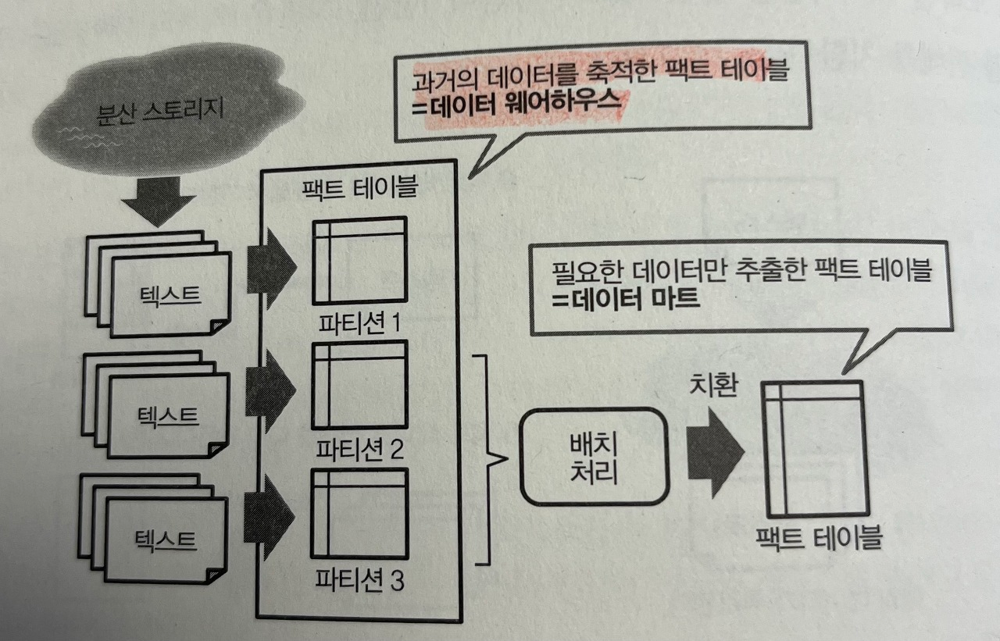

분산 시스템이 준비되면 시각화를 위해 데이터 마트를 만드는 절차에 들어간다.

# 팩트 테이블(시계열 축적하기)
데이터 마트 구축에는 데이터를 구조화하는 것이 핵심이다. 이에 대해 팩트 테이블이 가장 중요하다.
팩트 테이블 구성에는 추가와 증분 두 가지 방식이 있다.

추가가 효율적이긴 하나, 오류가 발생할 경우 일부 데이터 중복이 발생할 수 있다.
이를 위해 테이블 파티셔닝을 진행한다.

보통 시점을 기준으로 파티션을 나누어서 데이터 웨어하우스에 축적해두고 배치 처리를 통해서 중복된 데이터는 치환하고
필요한 데이터만 추출하여 데이터 마트로 보낸다.

데이터 치환 시에는 일부만 치환할 것인지, 전체를 치환할 것인지를 정해햐 한다.
보통 전체 치환이 스키마 변경에도 대응하기 좋고, 데이터 마트에 중복 데이터가 발생할 가능성도 없지만 처리 시간이 느려진다.
보통은 팩트 테이블을 만드는데 1시간 이내가 걸리면 전체 치환의 방식을 택한다.

# 집계 테이블(레코드 수 줄이기)
팩트 테이블을 어느정도 모아서 미리 집계한 것이 집계 테이블이다.
이를 위해서는 필요한 컬럼을 골라서 그에 따라 숫자 데이터를 집계하기만 하면 된다.

이 때 컬럼이 취하는 범위인 카디널리티를 작게해야한다. 그래야 레코드 수를 최소화할 수 있기 때문이다.
하지만 너무 줄이면 데이터 손실이 발생할 수 있다.

저장된 데이터를 효율적으로 추출하기 위해서는 쿼리 작성 당시에, 최대한 중간 데이터를 줄여야 한다.
즉 무작정 전부 join 하지 말고, 필요한 컬럼들만 불러와서 최소한의 데이터들끼리만 join 해야 한다.

> 집계 테이블 작성 시에 처음 불필요한 디멘젼을 제거함으로써 데이터 마트가 작아지고 시각화 기능이 향상된다.
> 단 평균이나, count는 기준에 따라 다른 수가 나오므로 집계 시에 주의해야 한다.
> 
> 평균의 평균과 전체 평균은 값이 다르다.

# 스냅샷 테이블(마스터의 상태를 기록하기)
마스터 데이터가 있는 테이블을 통째로 저장하는 방법이 스냅샷 테이블이다. 변경 내용만을 저장하는 방법으로는 이력 테이블이 있다.
이러한 이력은 보통 디멘젼 테이블의 이력을 기록하는 것이다.

스냅샷 테이블은 특정 시점의 테이블 상태를 기록한 것이므로 영구적인 저장소에 잘 보관해야 한다.

또한 스냅샷 테이블은 다른 테이블과도 결합하여 데이터를 분석할 수 있다. 
이때 스냅샷 테이블을 하나의 비정규화 테이블로 만들어서 스냅샷 해두는 것이 좋다.

# 이력 테이블(마스터 변화 기록하기)
작업시의 데이터 양을 줄이기엔 좋지만, 완전한 마스터 테이블을 나중에 복원하는 것이 어려워지므로 디멘젼 테이블로는 사용하기 힘들다.

# 디멘젼을 추가하여 비정규화 테이블 완성하기
팩트 테이블과 디멘젼 테이블을 결합하여 비정규화 테이블을 만들고 이러한 테이블이 데이터 마트로서 최종적으로 시각화에 활용된다.
이 때 카디널리티를 최대한 작게하고 시각화에 필요없는 컬럼은 삭제한다.